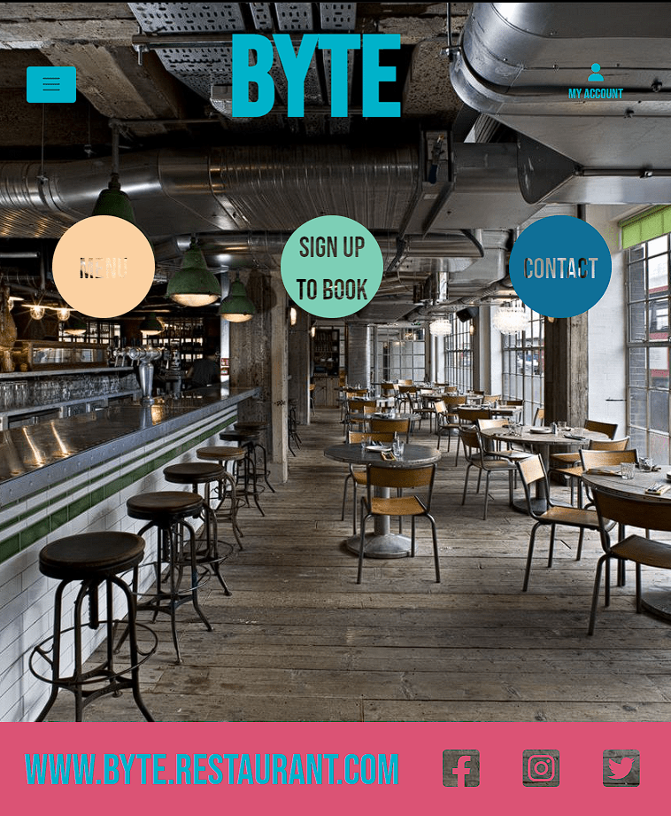
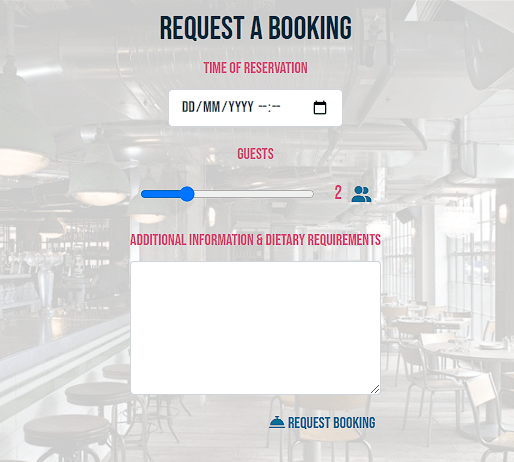
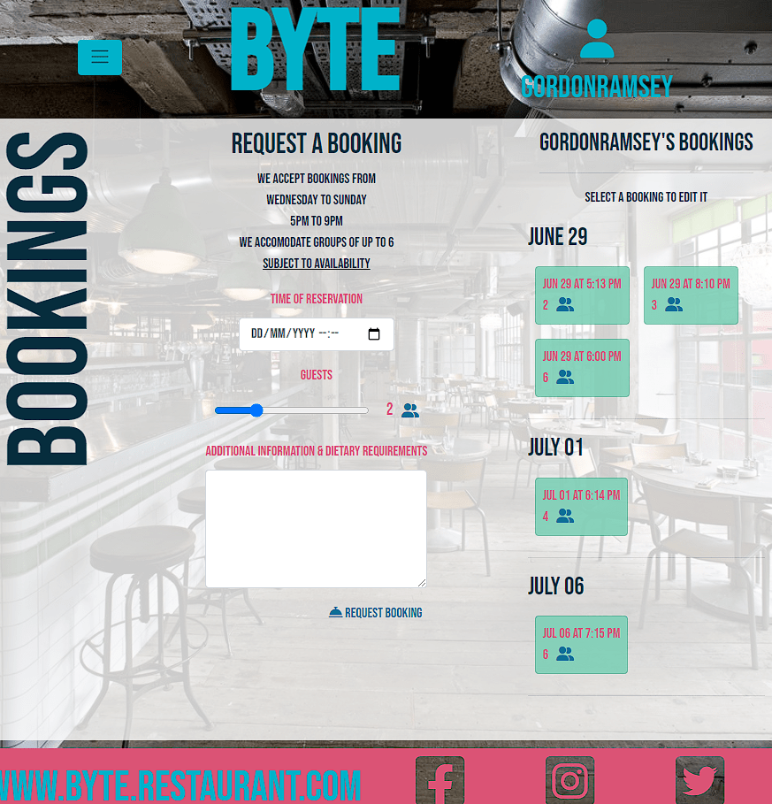
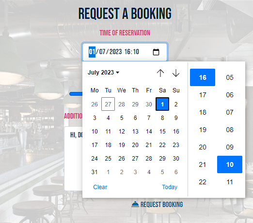

# BYTE: Restaurant Booking Site

    This is a restaurant reservation web application using Python with Django, and a Postgres relational database.
    The site has a model view controller to allow customers to make bookings following CRUD principles, and to give administrative access to the site owner only.

# Site Goals

- The purpose of this site is to allow customers to make bookings in a particular restaurant. 
- The booking system should employ strong logic and consider real world business needs in order to be an efficient replacement for a manual means of restaurant reservation management.
- The site should reflect the restaurant and offer a satisfying user experience.

# Agile Development

- This project follow Agile principles and methodologies through assessing the Clear Value Proposition of User Stories

- The User Stories are catalogued using github's issues and projects features. The project is linked to the repository for this project, and set to public, and it should be visible to the assessment panel.

## Epics and User Stories

    Epic 1: User-Friendly Restaurant Booking Site

    User Story 1: As a user, I want a visually appealing and intuitive interface for the restaurant booking site.
    User Story 2: As a user, I want a responsive design that adapts to different devices and screen sizes.
    User Story 3: As a user, I want clear and consistent navigation throughout the site.
    User Story 4: As a user, I want a user-friendly booking form with intuitive inputs.
    User Story 5: As a user, I want visually appealing and informative feedback messages when interacting with the site.
    User Story 6: As a user, I want a visually appealing and informative dashboard to manage my bookings.

    Epic 2: Table Booking Functionality

    User Story 1: As a user, I want to be able to book a table for a specific time and party size.
    User Story 2: As a user, I want to see the availability of tables for a specific date and time.
    User Story 3: As a user, I want to receive real-time availability updates when selecting a date and time.
    User Story 4: As a user, I want the option to choose from available tables based on my party size.
    User Story 5: As a user, I want to be able to select additional preferences or requirements for my booking.

    Epic 3: Booking Management

    User Story 1: As a user, I want to view my bookings and their details.
    User Story 2: As a user, I want to edit or update my existing bookings.
    User Story 3: As a user, I want to cancel or delete my bookings.
    User Story 4: As an owner, I want to view all bookings made at my restaurant.
    User Story 5: As an owner, I want to confirm or reject bookings made by users.
    User Story 6: As an owner, I want to manage and update the availability of tables for different time slots.

    Epic 4: Intelligent Booking System

    User Story 1: As an owner, I want to prevent double bookings of tables and time slots.
    User Story 2: As an owner, I want to handle concurrent booking requests without conflicts.
    User Story 3: As an owner, I want to implement automatic table assignment based on availability and party size.
    User Story 4: As an owner, I want to handle reservation overlaps or conflicts gracefully.

    Epic 5: Security and Privacy

    User Story 1: As a user and owner, I want secure authentication and authorization mechanisms.
    User Story 2: As a user and owner, I want my personal and sensitive information to be securely stored and encrypted.
    User Story 3: As a user and owner, I want secure communication over HTTPS.
    User Story 4: As a user and owner, I want protection against common security vulnerabilities

    Epic 6: Error Handling and Feedback

    User Story 1: As a user and owner, I want meaningful and descriptive error messages for input validation.
    User Story 2: As a user and owner, I want informative feedback messages for successful actions.
    User Story 3: As a user and owner, I want clear error handling and fallback mechanisms for unexpected situations.
    User Story 4: As a user and owner, I want detailed logs of errors and exceptions for troubleshooting and debugging.

    Epic 7: User Registration and Account Management

    User Story 1: Utilise and implement django's Allauth library for all user account operations.
    User Story 2: Customise the allauth templates to style them so that they feel a part of the site.

# UX/UI

Example sites for restaurant home pages

| |  |  |  |
|----------------------------|------------------|----------------------|-------------|
| Wireframes for project mock-up |
|  |  |

# Logic

|Booking logic Flowchart|
|-----------------------|
||

The user selects a day and time, and a party size. Initial handling for the day and time prompt the user to select a future date, and in this case not a Monday or Tuesday, and a time within the 5-9 oping hours of the restaurant.

Once inputs are intitally valid, the view calculates the end time as 105minutes, an hour and three quarters, after the start time. It then checks through existing tables for a conflicting booking where the existing bookings start time is earlier than the new bookings end, or its end later than the new start.

It iterates through tables in an order based on party-size. It will seek to put a party of 1 or 2 and a 2 seater table first, before iterating through larger tables.

As soon as it finds a valid time slot a table availability model instance is created, tying the booking instance and table instance together. 

To edit a booking the same operation is performed. The old table availability model is deleted and a new one generated. Similarly, if an admin deletes a table, all bookings for that table will attempt to migrate to other tables, but if a valid table availability, or time slot cannot be establish then the deleteion operation is cancelled and the admin informed.

Deletion of models is controlled by security measures in the views. A deletion of a booking or table is not possible through url manipulaton. The relevant views are controlled by if statements. If an attempt to trigger the delete table view by any other than a superuser, or to delete a view by any other than a superuser or the booking owner, that user is redirected to the index with an explanation message.

Equally, pages meant for admins or pages, personal to a user, such as edit of their specific bookings are secured by if statements, and an unwelcome user is booted to the index.

There is a nice feature where user's additonal infor and dietary requirements fields for bookings are scanned for keywords. Terms such as veggie or allergies will result in an informative icon being present on the booking card for the admin to see. This improves the reliability of the message attribute, and gives great value to the restaurant owner and their customers as customer service and satisfaction levels will benefit from this stronger line of communication.

|Plans for Models|
|----------------|
||

# Testing

## Error Log

    1
    Issue: Changes made to allauth html files take no effect on rendered pages in development server
    Resolve: Included the following lines in project settings:
        "TEMPLATES_DIR = os.path.join(BASE_DIR, 'templates')"
        "TEMPLATES = [
            {
                'BACKEND': 'django.template.backends.django.DjangoTemplates',
                'DIRS': [TEMPLATES_DIR],
                ..."

    2
    Issue: Can't render home view. Attempting to run dev server from terminal results in: AttributeError: module 'home.views' has no attribute 'index'
    Resolve: Apps were not registered in project settings. Additional changes to settings made, including targeting media and static. Homepage functional.

    3.
    Issue: Bookings toggle the table model boolean of availability to a constant false. However, we only want this toggled for the time and day of a booking.
    Resolve: Create a new model to better handle identifying available times.

    4.
    Issue: Form only accepts party sizes that match the table size. We want a party of three to be assigned to a table of 4, but a party of 2 assigned to a table of 2 before a 4.
    Resolve: View now searches for tables with availability that have an occupancy greater or equal to the party size, and searches for the smallest possible table first.

    5.
    Issue: A booking can now be edited by a user, however their booking can interfer with a change. Say f a user has a particular booking of 4 people on a day. And all tables are reserved, but the user wants to amend their booking to three people the view tells them there is no table available, even though the change can be made on the table they already booked.

    6.
    Issue: Cancel anchor not activation view, or view not working.
    Resolve: Firstly, the url was not confirgured correctly, sharing, and therefore overridden by the edit url.
    Additionally, on successfuly deletion user was brought to an error page because the delete view redirect was sending them to the edit url for the now deleted object. To circumvent this the delete call is added to the bookings page, not edit page, and redirects to itself, which is not dependant on a object/id url.

    7.
    Issue: I'm trying to get the second div in bookings to disappear if there are no bookings for the current user. However it is currently working as only disappearing if there are no existing bookings for any user, i.e. booking in current booking.
    Resolve: Not resolved. The div exists because there are bookings in current bookings, and bookings by all customers exist in that list, not just the current user. To fix this later we would have to create a new list in the view of current users bookings in current_bookings and then run the template with if bookings in current user's bookings.

    8:
    Issue: When a table is edited by its start time it leaves behind the table availability instance, which only collapses with a delete.
    Resolve: The code I've tried is attempting to delete old instances of availability, but I believe its tracking them using the id of the edited booking which has changed from the original booking.
    - The table availability model doesn't take in the booking's id. In fact the booking only gets an id on its instansiation, which naturally is after the table availability instansiation since it is a requirement for the booking to exist. Maybe I can edit the table availability instance after the booking is created.
    - Changed the booking view block for making a table availability object. Table availability object now takes in the whole booking object and generates an attribute 'id_of_booking' from the objects id. The edit view now finds the objects that have that attribute = to its own booking objects id and deletes them before creating a new one. It does this now whether or not the edit involved the start date, and thus warranted a new time slot in the form of the table availability object.

    9: 
    Issue: Unable to make a second booking for a time when a booking already exists, even if there are empty tables.
    Resolve: I think that the code is identifying that there is an overlapping instance so returns error, rather than repeat the check for other available tables.

## Testing for all user stories

### E1: User-Friendly Restaurant Booking Site


#### 1: As a user, I want a visually appealing and intuitive interface for the restaurant booking site.
#### 3: As a user, I want clear and consistent navigation throughout the site.

| Small Screens | Medium Screens | Larger Screens | 
|---------------|----------------|----------------|
|  |   |  |
|On mobile screens the main menu, as links to the primary sites of the websites, are large, block colour divs. | On larger screens these divs are replaced by circular counterparts, revealing the attractive background image, purporting to be the interior of our imaginary restaurant, Byte. | On the largest screens, the circular divs stack to the left to allow for a better balance of content and interface across the screen |

| Navigation Bar | Burger Dropdown | Account Dropdown | Return Home Links |
|----------------|-----------------|------------------|-------------------|
|  |  |  |  |
| The navigation bar has been added in as a substitute for the hamburger dropdown menu on larger screens. It is made a bit superfluous by the circular divs to regular uses who don't need a link to booking management, and just see the same options in both, however with the inclusion of more site pages, such as an about us, or gallery section then the navigation bar will add more value. | The burger dropdown has links to all pages of the site, and adjust depending on the scope of the logged in user's access, or whether they are logged in at all. It is replaced by the navbar for larger media queries. | The account dropdown offers the standard options of sign in up out for users, and additionally repeats links to admin pages. The reason for repeating here is that being the account area, and the admin's abilities are directly related to their account type it feels like a relevant route that an admin might intuitively take to find their account specific accesses. Additionally the account text is replaced by the logged in user's name, reflecting their logged in status. This text disappears on mobile to optimise screen space usage. | The restaurant and site logo, BYTE, and the website address in the footer are present at all screen sizes and for all pages, and serve as a link for users to the homepage. |


#### 2: As a user, I want a responsive design that adapts to different devices and screen sizes.

| Mobile | Tablet | Desktop |
|--------|--------|---------|
|  |  |  |
|  |  |  |
|1. While not signed in, the book text is replaced by text to big for its div. This could be reduced in size. 2.The hamburger dropdown element disappears on smaller device sizes, so this needs to be corrected. 3.The icons in the footer, as well as the account icon, are all too small. | 1. On medium screens the 'MENU' link is illegible against the background image. Finding a graceful solution that allows us to maintain the effect with the background and cut out divs would be ideal. 2. Additionally the dropdown, though the reduced opacity is part of our website's theme, doesn't homogenise well with the rest of the screen here. It's too small and its floating right of the hamburger inexplicably. | 1. The hamburger dropdown should be replaced with a navbar, though its contents are already the main elements of the page. But we should have other pages, such as reviews, or an about us section to link to. 2. The layout could be altered to make better use of the increased space. 3. Some elements need to be adjusted so that they stop scaling with screen size at a certain point. |
|  |  |  |
|  |  |  |
| 1. The hamburger dropdown menu is now working properly. 2. All icons have been made larger, and the text beneath account is removed at this screen size, the website name in the footer is changed to an icon also. 3. The "sign up to book" text has been reduced to the text "sign up" in order to fit. | 1. The text in the circle divs has been changed to the hot pink of the theme's color palette, but, as shown on the contact option, they revert to the cut out style on hover. 2. The website icon reverts to the site name at medium screen sizes also. 3. The dropdown from the hamburger is more legible, instead of the opaque theme, it repeats the pink and blue of palette and the font is larger. Its also given a tidier margin from the burger icon. | 1. For desktop the burger has been removed as a nav bar would be more appropriate, but not yet implemented. 2. The circle divs have had their responsive scaling capped at 1200px screen width. As have the footer icons. 3. Additionally, the account icon should be further right. The circle divs could stack to the left under the h1, the space could be used to show reviews or the content from other pages. The footer icons would look better if they were bunched to the right of the screen. |


#### 4: As a user, I want a user-friendly booking form with intuitive inputs.

| Booking Form Mobile | Booking Form Larger Screens |
|---------------------|-----------------------------|
|  |  |
| This is our booking form on mobile. It requires three inputs, a date & time, party size, and an optional message. Other information is populated automatically from the user model. The party-size slider automatically starts on 2. | For larger screens, a user's bookings are shown on the right, and a verticle graphic of the page on the left which is a theme throughout several site sections. Additionally, details of the opening times and party-size policy are listed above the form. |

| Date & Time Widget | Party size Slider Widget |
|--------------------|--------------------------|
| |  |
| The form uses a Django forms widget, DateTimeInput. It offers users a way of selecting their date in a clear format. The field could be further enhanced if the invalid choices could be removed or made unselectable, such as Mondays, Tuesdays, and out of business hours. | The widget slider makes it clear to users the limited party-size and has made previous invlaid input handling redundant, as only accepted values can be made. The slider value is reflected in real-time through javaScript. |


#### 5: As a user, I want visually appealing and informative feedback messages when interacting with the site.

| User action feedback Messages |
|-------------------------------|
| The project employs descriptive error and success messages throughout. The messages disappear themselves, so as not to be overly intrusive, but intuitively, they persist on cursor hover. They also include a dismiss button, in the form of a whimsical, bouncing fav icon, seen mid-jump in some screengrabs below. |
| General error with booking |
|  |
| Handling error for selection of past dates |
|  |
| Successful deletion of a booking |
|  |
| Successfuly editing of a booking |
|  |

#### 6: As a user, I want a visually appealing and informative dashboard to manage my bookings.


| User Bookings Dashboard | Mobile Dashboard |
|-------------------------|------------------|
|  |  |
| The user bookings dash on larger screens is a section of the bookings page for larger screens. On mobile the section is hidden and the hamburger displays a new link to the user bookings page. The user's name is autofilled at the top, reflecting logged in status and add personalisation to the site. The user is directed to select any booking they wish to edit. The bookings card is customised to display only necessary information, whereas the bookings card the admin sees display the user names, this is unnecessary for a regular user. |

| When a user finds themselves on their bookings page without any active bookings this state is displayed back to them and they are invited to make a booking with a link to the relevant page. |
|--------------------|
|  |

The list of bookings is set in a scrollable container allowing the page to remain static. All y scroll lists are padded at the end to ensure users can see the full list. Below are images of the list as it was originally, and now updated to homogenise with the rest of the site. While the diary has an x-scroll for each day or week, as well as a y-scroll allowing lists of day after day, week after week, this functionality isn't necessary for a single user who is less likely to have multiple bookings for a given day or week. Such an instance is handled by wrapping the items with flexbox, as demonstrated below.

| |  |
|----------------------------|--------------------------------|
|||

| On click of a booking card the user is directed to a bookings detail template, populated with the details of the given booking. They have the option to delete the booking, redirecting them back to bookings. They can edit the booking which replaces their current section with the booking form pre-populated with the given bookings values. On either section they have the option to cancel the operation, which will bring them back to their previous page. |
|---------------------------------------------------------------|
|  |
|  |

### E2: Table Booking Functionality

#### 1: As a user, I want to be able to book a table for a specific time and party size.    

    A user can book for groups of up to 6 people. They can select from times when the restaurant is open. If their booking does not conflict with another booking and there is an available table, the booking will be made successfully.

#### 2: As a user, I want to see the availability of tables for a specific date and time.

    While the project affirms booking success or failure due to lack of availabiliy, it does not implement a view to show users the restaurant's availabilities. 
#### 3: As a user, I want to receive real-time availability updates when selecting a date and time.

    Updates are limited to clicking of the booking submit button. In theory an attempt to create a booking could be made each time the user input a value into the booking form fields, and give immediate feedback on the success or failure of the pending booking. Further, unacceptable values of date time and party size could be removed from the widget options. For instance a user may choose a Friday for their booking. All time slots are available, and they select the prefered time, and then widget slider is reduced to options up to 4 as there is only 1 table of 4 available for the selected time.

####  4: As a user, I want the option to choose from available tables based on my party size.

    Tables are assigned automatically rather than user's being given the option. The selection proccess attempts to match tables to the most appropriate table sizes. For instance with a party of three the view will iterate through availabilities of tables of 4 before looking at tables of 6.
    
#### 5: As a user, I want to be able to select additional preferences or requirements for my booking.

| User's can leave a message with their booking. It is an open character field, and readable by the admin. I would like to include a feature that identified key words and phrases in this field and returned a value on the bookings card, to highlight message contents. For instance searching for terms, 'veggie', 'vegetarian', 'vegan', 'meat', and then displaying an icon on the bookings card. The value of this would be to highlight customer requirements, and ensure they are less likely to be forgotten when messages may go unread. |

| Additional information field for the booking form, and used in the edit form. | The message as readable by the admin in the details section | Upgraded for better visibility |
|-------------------|------------------|--------|
| |  |  |

| I've now implemented that feature to highlight booking requirements to the admin. Requirements are present in both the booking management template and The Diary template. | They are created by searching through the additional attribute value for bookings, if there is one, by keywords in the views. |
|---------------------------------------|-------------------------------------------|
|  |  |


### E3: Booking Management

        1: As a user, I want to view my bookings and their details.
        2: As a user, I want to edit or update my existing bookings.
        3: As a user, I want to cancel or delete my bookings.
        4: As an owner, I want to view all bookings made at my restaurant.
    5: As an owner, I want to confirm or reject bookings made by users.
    6: As an owner, I want to manage and update the availability of tables for different time slots.

### E4: Intelligent Booking System

        1: As an owner, I want to prevent double bookings of tables and time slots.
        2: As an owner, I want to handle concurrent booking requests without conflicts.
        3: As an owner, I want to implement automatic table assignment based on availability and party size.
        4: As an owner, I want to handle reservation overlaps or conflicts gracefully.

###  E5: Security and Privacy

        1: As a user and owner, I want secure authentication and authorization mechanisms.
        2: As a user and owner, I want my personal and sensitive information to be securely stored and encrypted.
        3: As a user and owner, I want secure communication over HTTPS.
        4: As a user and owner, I want protection against common security vulnerabilities

### E6: Error Handling and Feedback

        1: As a user and owner, I want meaningful and descriptive error messages for input validation.
        2: As a user and owner, I want informative feedback messages for successful actions.
        3: As a user and owner, I want clear error handling and fallback mechanisms for unexpected situations.
        4: As a user and owner, I want detailed logs of errors and exceptions for troubleshooting and debugging.

### E7: User Registration and Account Management

        1: Utilise and implement django's Allauth library for all user account operations.
        2: Customise the allauth templates to style them so that they feel a part of the site.

# Deployment

## Local Deployment from Github

    To deploy a Django application built on GitHub locally, you can follow these general steps:

1. Clone the Repository: Start by cloning the GitHub repository that contains your Django application code onto your local machine. You can use the following command in your terminal or command prompt:
```
git clone <repository_url>
```

2. Set Up the Environment: Create a virtual environment to isolate the dependencies of your Django application. Navigate to the project directory and create a virtual environment by running the appropriate command for your operating system:
```
python3 -m venv myenv       # For macOS and Linux
python -m venv myenv        # For Windows
```
Activate the virtual environment:
```
source myenv/bin/activate  # For macOS and Linux
myenv\Scripts\activate     # For Windows
```

3. Install Dependencies: With the virtual environment activated, install the required dependencies by using the package manager pip. Ensure you navigate to the project directory where the `requirements.txt` file is located, and then run:
```
pip install -r requirements.txt
```

4. Configure the Database: If your Django application uses a database, configure the database settings in the `settings.py` file within your project. You'll need to provide the necessary credentials and connection details for your local database server (e.g., PostgreSQL, MySQL, SQLite).

5. Run Database Migrations: Apply the database migrations to set up the database schema. Run the following command in the terminal:
```
python manage.py migrate
```

6. Create a Superuser (Optional): If your application utilizes Django's authentication system, you may want to create a superuser to access the admin interface or perform administrative tasks. Use the following command and follow the prompts to create a superuser:
```
python manage.py createsuperuser
```

7. Run the Development Server: Start the Django development server with the following command:
```
python manage.py runserver
```
This will launch the server locally, and you can access your application by opening a web browser and navigating to `http://localhost:8000/`.

These steps provide a general outline for deploying a Django application built on GitHub locally. However, keep in mind that additional configuration may be required based on the specifics of your project, such as static file handling, media file setup, or custom settings. Make sure to consult the project documentation or README file for any additional instructions specific to your application.

## Deployment to Heroku

    Log into Heroku account. Click "NEW" on the Dashboard, select "Create new app" from the drop-down. Give the app a unique name, and click "Create app" to confirm.

    Log into ElephantSQL. Click "Create New Instance" on the Dashboard. Give your new plan a Name, select the Tiny Turtle (free) plan, the Tags field can be left blank. Select Region: EU-West-1 (Ireland). Then click "Review", confirm details, and click "Create instance".

    Return to the ElephantSQL Dashboard and click "database instance name" for this project, in the URL section, click the copy icon to copy the database URL.

    In the project workspace create a env.py file, ensure this is listed in the .gitignore file. In the env.py file write import os. After a blank line type:  os.environ["DATABASE_URL"] = "<copiedURLfromElephanSQL>". This will need a secret key as Django application so beneath the url type:  os.environ["SECRET_KEY"] = "any_secret_key". And save the file.

    In settings.py add the followng code to the Path import:  import os
    import dj_database_url
    if os.path.isfile('env.py'):
        import env
    A little further down, remove the insecure secret key provided by Django. Instead, we will reference the variable in the env.py file, so change your SECRET_KEY variable to the following:  SECRET_KEY = os.environ.get('SECRET_KEY').
    Next in settings.py, where you find the following:
    DATABASES = {
        'default': {
            'ENGINE': 'django.db.backends.sqlite3',
            'NAME': BASE_DIR / 'db.sqlite3',
        }
    }
    Replace with: 
    DATABASES = {
        'default': dj_database_url.parse(os.environ.get("DATABASE_URL"))
    }

    Save the settings file and run the terminal command "python3 manage.py migrate".
    Follow this up and add, commit, push the project to gihub.

    Return to the Heroku Dashboard and select the Settings tab. Add some config vars:
    DATABASE_URL with the value of the copied url from ElephantSQL,
    SECRET_KEY with value of the secret create in env.py file.
    PORT with value of 8000.

    To connect Cloudinary to the Heroku project, set up a free account on Cloudinary.
    On the Cloudinary dashboard select Copy To Clipboard next to API Environment Variables.

    In the env.py file, add at the bottom, os.environ["CLOUDINARY_URL"] = "Value copied less the beginning part of CLOUDINARY_URL="
    Copy this value again without the prefix and return to Heroku settings, Config Vars.

    Add new Config Var:
    CLOUDINARY_URL  with value of copied text.

    In settings.py under INSTALLED_APPS: above 'django.contrib.staticfiles', add 'cloudinary_storage', below 'django.contrib.staticfiles', and 'cloudinary'.

    Near the end of settings file below STATIC_URL = '/static/' add
    STATICFILES_STORAGE = 'cloudinary_storage.storage.StaticHashedCloudinaryStorage'
    STATICFILES_DIR = [os.path.join(BASE_DIR,'static')]
    STATIC_ROOT = os.path.join(BASE_DIR, 'staticfiles')

    MEDIA_URL = '/media/'
    DEFAULT_FILE_STORAGE = 'cloudinary_storage.storage.MediaCloudinaryStorage'

    At the top of settings.py, under BASE_DIR type
    TEMPLATES_DIR = os.path.join(BASE_DIR, 'templates')

    Scroll to half way down to TEMPLATES =, and in the 'DIRS': [] line, between the square brackets type TEMPLATES_DIR.

    Scroll back up, and below DEBUG = True, skip a line and type: 
    ALLOWED_HOSTS = ['*herokuappname*.herokuapp.com', 'localhost']

    Create three directories in the top level, next to manage.py file: templates, media, and static. Additionally create a Procfile. Inside the Procfile add the line:
    web: gunicorn appname.wsgi

    Save, add, commit, and push the project.

    In the Heroku Dashboard, click on the Deploy tab, click on the option to Deploy through Github, this may need to be set up if its your first time. Search your repositories for the project. Scroll to the bottom of the page and select Deploy Branch.

    Once the the app is deployed successfully, the Open App button will bring you to the working application.

# Credits

- Favicon 
https://favicon.io/favicon-generator/
Creating custom icon for project

- Coolors
https://coolors.co/
Creating complimentary palette for project

- StackOverflow

- https://www.trainspotters.co.uk/projects/pizza-east-london-lighting-project-pizza-east/
Background image