# BYTE: Restaurant Booking Site

    This is a restaurant reservation web application using Python with Django, and a Postgres relational database.
    The site has a model view controller to allow customers to make bookings following CRUD principles, and to give administrative access to the site owner only.

# Site Goals

- The purpose of this site is to allow customers to make bookings in a particular restaurant. 
- The booking system should employ strong logic and consider real world business needs in order to be an efficient replacement for a manual means of restaurant reservation management.
- The site should reflect the restaurant and offer a satisfying user experience.

# Agile Development

- This project follow Agile principles and methodologies through assessing the Clear Value Proposition of User Stories

- The User Stories are catalogued using github's issues and projects features. The project is linked to the repository for this project, and set to public, and it should be visible to the assessment panel.

## Epics and User Stories

### Restaurant Owner Epics
- The site should be able to supply all information the customers could need. It should be laid out clearly and rationally. It should be easy, and enticing, for customers to make bookings. Bookings should be made with sophistacted logic, taking into account the restaurants capacity, opening times/days, and to not double book a table, but to also host multiple sittings per table.

1. USER STORY: Restaurant owner needs to see what bookings have been made
2. USER STORY: Restaurant owner should be able to have full CRUD capability for all bookings
3. USER STORY: Double bookings should not occur
4. USER STORY: Customers contact details need to be given to the owner
5. USER STORY: Passwords, bookings, contact information should all be secure, and not visible to other customers

### Customer Epics
- The site should be clearly laid out, easy to navigate, on any device. I want to see the menu, contact details and location, nearby parking etc. I want to be able to make a booking for any number of people, and to be able to choose a suitable time.

6. USER STORY: The menu, contact details, and location of the restaurant should be present
7. USER STORY: The site should be easy to understand, navigate and use
8. USER STORY: Customers need CRUD capability
9. USER STORY: Customers should be able to find an available booking slot for their party size
10. USER STORY: Customers should be able to attach a message to their booking for the owner to see
11. USER STORY: Any of the customers data manipulations should be confirmed with relevant feedback

# Credits

- Favicon 
https://favicon.io/favicon-generator/
Creating custom icon for project

- Coolors
https://coolors.co/
Creating complimentary palette for project

- StackOverflow
- CHATGPT
For error query and solving

# Deployment

## Local Deployment from Github

Clone the repository: Go to the repository on GitHub and click on the "Code" button. Select "HTTPS" and copy the URL. Open your terminal or command prompt and navigate to the directory where you want to store the repository. Use the git clone command followed by the copied URL to clone the repository to your local machine.

Install dependencies: If the project requires any dependencies, you need to install them on your local machine. The project should have a requirements.txt file. In the development terminal use the command line $ "pip3 install -r requirements.txt" to automatically populate the environment with the listed dependancies.

Configure environment variables: Create an env.py file. Import os at the top of the file and list variables as follows:
os.environ.setdefault("SECRET_KEY", "Oisin")
os.environ.setdefault("DEBUG", "True")
os.environ.setdefault("IP", "0.0.0.0.")
os.environ.setdefault("PORT", "8000")
os.environ.setdefault("DEVELOPMENT", "True")
os.environ.setdefault("DB_URL", "sqlite3:///byte")
os.environ.setdefault("ALLOWED_HOSTS", "localhost")

Run the project: Once you have installed the dependencies and set up the environment variables, you can run the project. In the terminal window, run the command line &"python3 manage.py runserver."

## Deployment to Heroku

Log into Heroku account. Click "NEW" on the Dashboard, select "Create new app" from the drop-down. Give the app a unique name, and click "Create app" to confirm.

Log into ElephantSQL. Click "Create New Instance" on the Dashboard. Give your new plan a Name, select the Tiny Turtle (free) plan, the Tags field can be left blank. Select Region: EU-West-1 (Ireland). Then click "Review", confirm details, and click "Create instance".

Return to the ElephantSQL Dashboard and click "database instance name" for this project, in the URL section, click the copy icon to copy the database URL.

In the project workspace create a env.py file, ensure this is listed in the .gitignore file. In the env.py file write import os. After a blank line type:  os.environ["DATABASE_URL"] = "<copiedURLfromElephanSQL>". This will need a secret key as Django application so beneath the url type:  os.environ["SECRET_KEY"] = "any_secret_key". And save the file.

In settings.py add the followng code to the Path import:  import os
 import dj_database_url
 if os.path.isfile('env.py'):
     import env
A little further down, remove the insecure secret key provided by Django. Instead, we will reference the variable in the env.py file, so change your SECRET_KEY variable to the following:  SECRET_KEY = os.environ.get('SECRET_KEY').
Next in settings.py, where you find the following:
  DATABASES = {
      'default': {
          'ENGINE': 'django.db.backends.sqlite3',
          'NAME': BASE_DIR / 'db.sqlite3',
      }
  }
Replace with: 
  DATABASES = {
     'default': dj_database_url.parse(os.environ.get("DATABASE_URL"))
 }

 Save the settings file and run the terminal command "python3 manage.py migrate".
 Follow this up and add, commit, push the project to gihub.

Return to the Heroku Dashboard and select the Settings tab. Add some config vars:
DATABASE_URL with the value of the copied url from ElephantSQL,
SECRET_KEY with value of the secret create in env.py file.
PORT with value of 8000.

To connect Cloudinary to the Heroku project, set up a free account on Cloudinary.
On the Cloudinary dashboard select Copy To Clipboard next to API Environment Variables.

In the env.py file, add at the bottom, os.environ["CLOUDINARY_URL"] = "Value copied less the beginning part of CLOUDINARY_URL="
Copy this value again without the prefix and return to Heroku settings, Config Vars.

Add new Config Var:
CLOUDINARY_URL  with value of copied text.

In settings.py under INSTALLED_APPS: above 'django.contrib.staticfiles', add 'cloudinary_storage', below 'django.contrib.staticfiles', and 'cloudinary'.

Near the end of settings file below STATIC_URL = '/static/' add
STATICFILES_STORAGE = 'cloudinary_storage.storage.StaticHashedCloudinaryStorage'
STATICFILES_DIR = [os.path.join(BASE_DIR,'static')]
STATIC_ROOT = os.path.join(BASE_DIR, 'staticfiles')

MEDIA_URL = '/media/'
DEFAULT_FILE_STORAGE = 'cloudinary_storage.storage.MediaCloudinaryStorage'

At the top of settings.py, under BASE_DIR type
TEMPLATES_DIR = os.path.join(BASE_DIR, 'templates')

Scroll to half way down to TEMPLATES =, and in the 'DIRS': [] line, between the square brackets type TEMPLATES_DIR.

Scroll back up, and below DEBUG = True, skip a line and type: 
ALLOWED_HOSTS = ['*herokuappname*.herokuapp.com', 'localhost']

Create three directories in the top level, next to manage.py file: templates, media, and static. Additionally create a Procfile. Inside the Procfile add the line:
web: gunicorn appname.wsgi

Save, add, commit, and push the project.

In the Heroku Dashboard, click on the Deploy tab, click on the option to Deploy through Github, this may need to be set up if its your first time. Search your repositories for the project. Scroll to the bottom of the page and select Deploy Branch.

Project set-up

    cmnd:  django-admin startproject 'project name' .

    Adding app for bookings
        cmnd:   python3 manage.py startapp 'app name'
        Register app name under installed_apps in settings.py

    Allauth set up
       cmnd: pip3 install allauth
        Add lines 
                    # `allauth` needs this from django
                    'django.template.context_processors.request',
        under templates in settings.py
        Add lines
                    'django.contrib.sites',

                    'allauth',
                    'allauth.account',
                    'allauth.socialaccount',
        under installed_apps in settings.py

        Create section in settings above templates
                    AUTHENTICATION_BACKENDS = [
                    # Needed to login by username in Django admin, regardless of `allauth`
                    'django.contrib.auth.backends.ModelBackend',

                    # `allauth` specific authentication methods, such as login by e-mail
                    'allauth.account.auth_backends.AuthenticationBackend',
                    ]
        Under installed apps
                    SITE_ID = 1
        In urls.py
                    from django.urls import path, include
                    from django.conf import settings

                    urlpatterns = [
                        path('accounts/', include('allauth.urls')),
                    ]
        
        allauth customisation

    To copy and paste folders and files from allauth site-packages first determine python version installed using cmnd: python --version In this case python3 3.8
    Create a folder, templates, and subfolder, allauth, from the project level directory
    Then run cmnd: 
    cp -r ../.pip-modules/lib/python3.8/site-packages/allauth/templates/* ./templates/allauth/

    Delete openid and tests folders, as unneeded for this project, deleting will revert use to site_packages templates for same.

UX/UI

Example sites for restaurant home pages

Wireframes for project mock-up

Logic

Booking logic Flowchart

Plans for Models

Testing and Errors

    1
    Issue: Changes made to allauth html files take no effect on rendered pages in development server
    Resolve: Included the following lines in project settings:
        "TEMPLATES_DIR = os.path.join(BASE_DIR, 'templates')"
        "TEMPLATES = [
            {
                'BACKEND': 'django.template.backends.django.DjangoTemplates',
                'DIRS': [TEMPLATES_DIR],
                ..."

    2
    Issue: Can't render home view. Attempting to run dev server from terminal results in: AttributeError: module 'home.views' has no attribute 'index'
    Resolve: Apps were not registered in project settings. Additional changes to settings made, including targeting media and static. Homepage functional.

    3.
    Issue: Bookings toggle the table model boolean of availability to a constant false. However, we only want this toggled for the time and day of a booking.
    Resolve: Create a new model to better handle identifying available times.

    4.
    Issue: Form only accepts party sizes that match the table size. We want a party of three to be assigned to a table of 4, but a party of 2 assigned to a table of 2 before a 4.
    Resolve: View now searches for tables with availability that have an occupancy greater or equal to the party size, and searches for the smallest possible table first.

    5.
    Issue: A booking can now be edited by a user, however their booking can interfer with a change. Say f a user has a particular booking of 4 people on a day. And all tables are reserved, but the user wants to amend their booking to three people the view tells them there is no table available, even though the change can be made on the table they already booked.

    6.
    Issue: Cancel anchor not activation view, or view not working.
    Resolve: Firstly, the url was not confirgured correctly, sharing, and therefore overridden by the edit url.
    Additionally, on successfuly deletion user was brought to an error page because the delete view redirect was sending them to the edit url for the now deleted object. To circumvent this the delete call is added to the bookings page, not edit page, and redirects to itself, which is not dependant on a object/id url.

    7.
    Issue: I'm trying to get the second div in bookings to disappear if there are no bookings for the current user. However it is currently working as only disappearing if there are no existing bookings for any user, i.e. booking in current booking.
    Resolve: Not resolved. The div exists because there are bookings in current bookings, and bookings by all customers exist in that list, not just the current user. To fix this later we would have to create a new list in the view of current users bookings in current_bookings and then run the template with if bookings in current user's bookings.

    8:
    Issue: When a table is edited by its start time it leaves behind the table availability instance, which only collapses with a delete.
    Resolve: The code I've tried is attempting to delete old instances of availability, but I believe its tracking them using the id of the edited booking which has changed from the original booking.
    - The table availability model doesn't take in the booking's id. In fact the booking only gets an id on its instansiation, which naturally is after the table availability instansiation since it is a requirement for the booking to exist. Maybe I can edit the table availability instance after the booking is created.
    - Changed the booking view block for making a table availability object. Table availability object now takes in the whole booking object and generates an attribute 'id_of_booking' from the objects id. The edit view now finds the objects that have that attribute = to its own booking objects id and deletes them before creating a new one. It does this now whether or not the edit involved the start date, and thus warranted a new time slot in the form of the table availability object.

## Testing
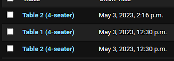

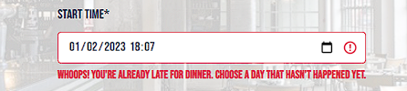
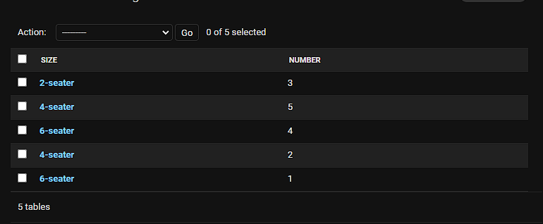
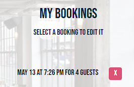
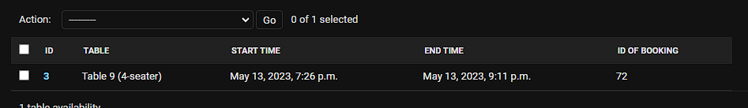
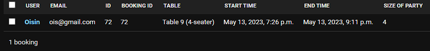
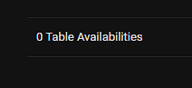
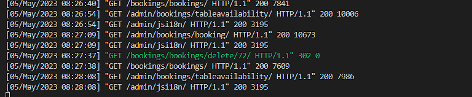
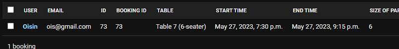
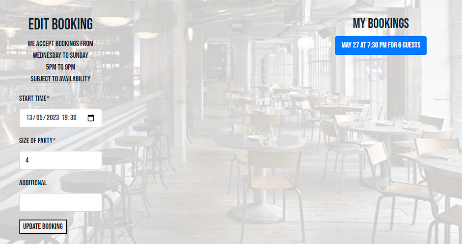
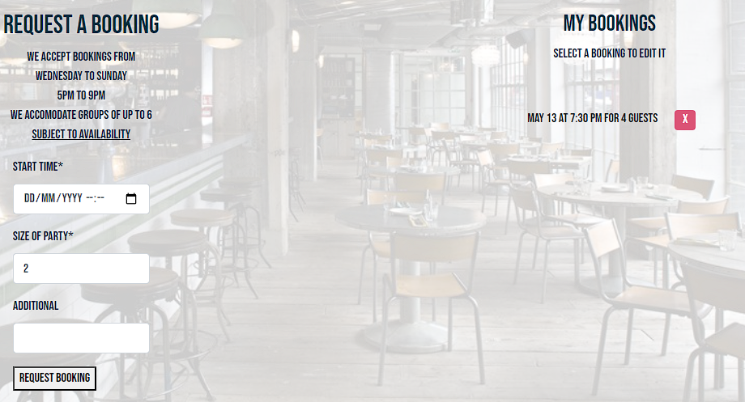
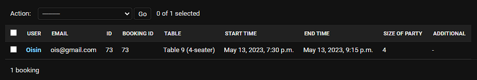
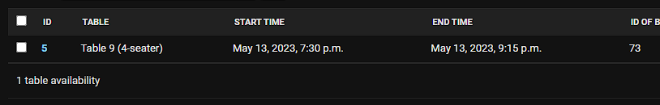
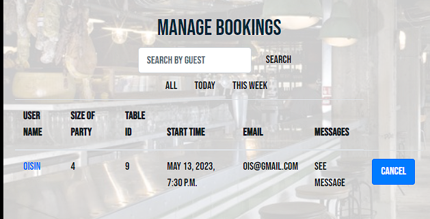
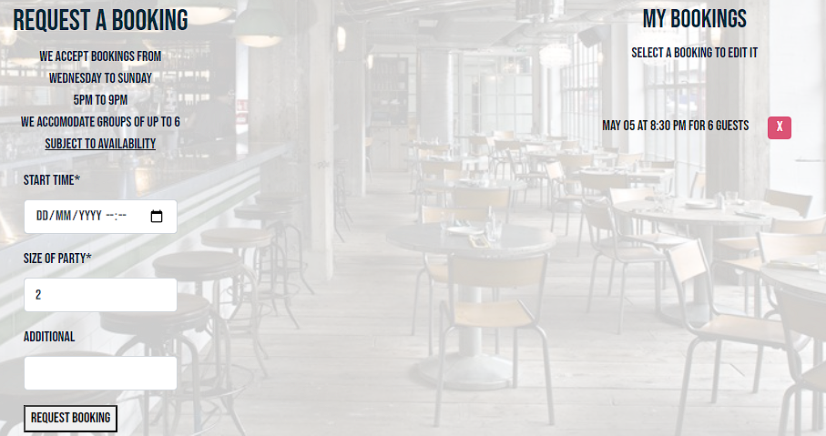
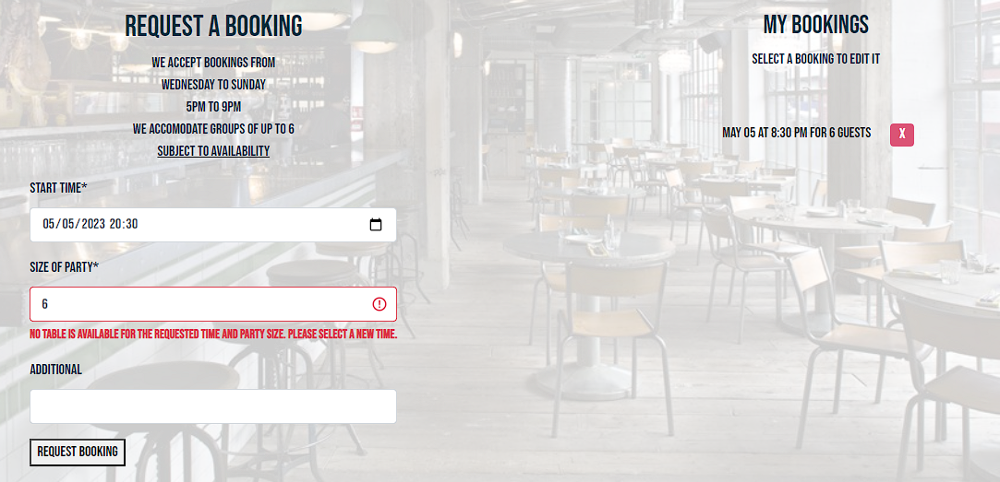
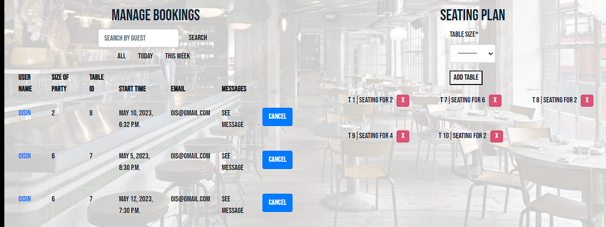
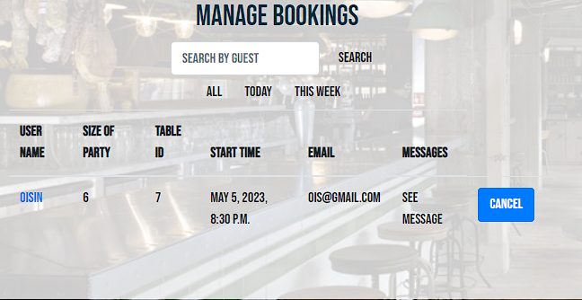
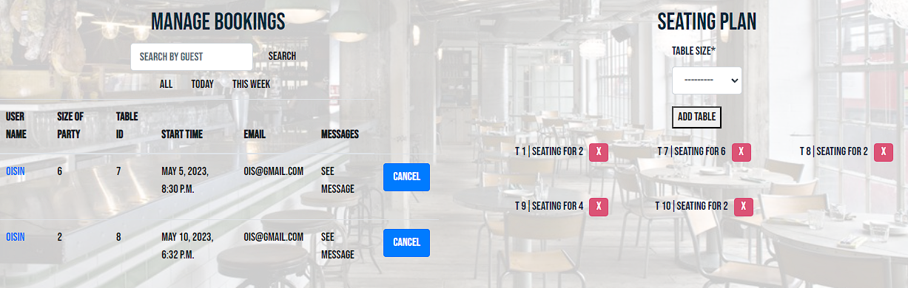
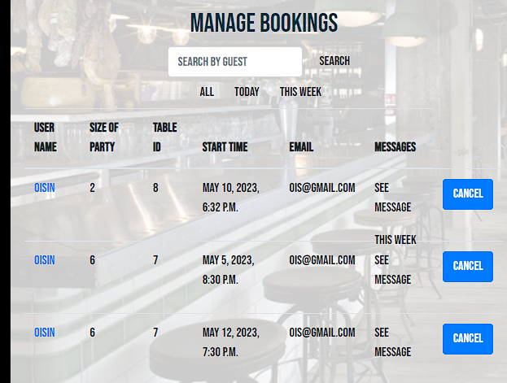
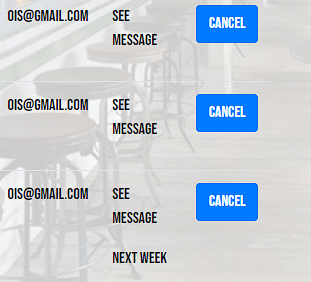
