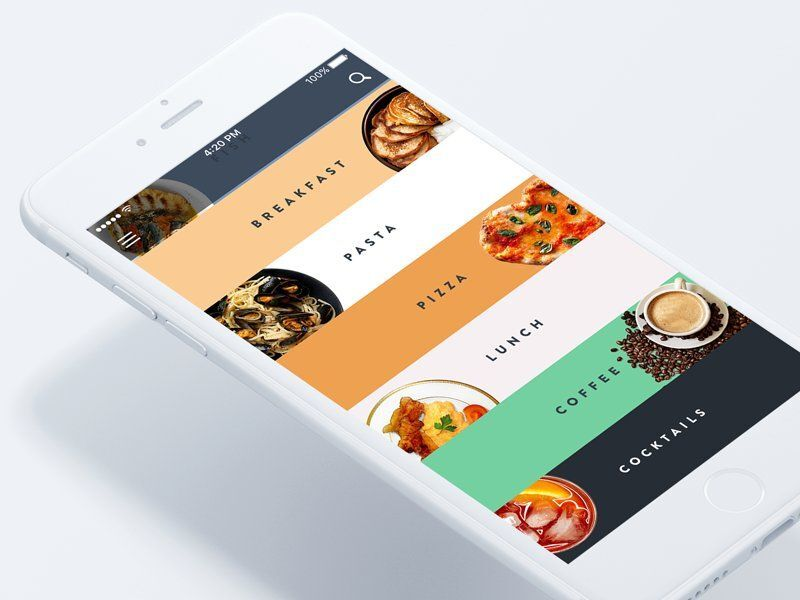
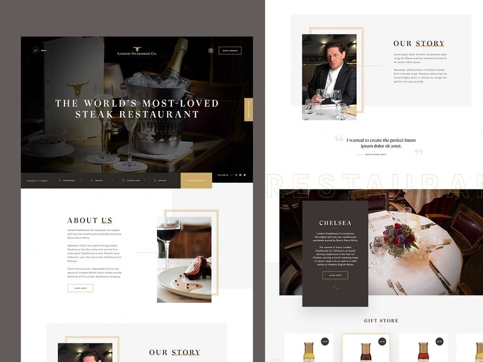
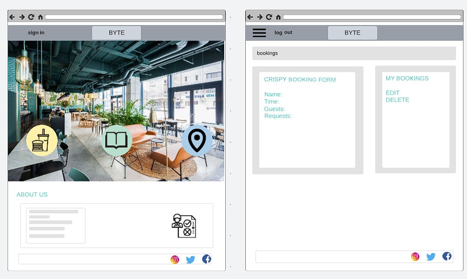
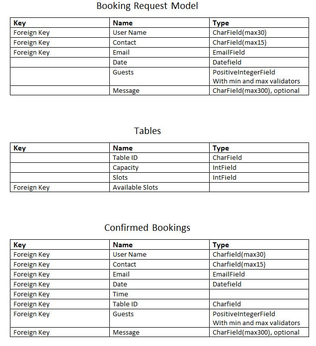

Project set-up

    cmnd:  django-admin startproject 'project name' .

    Adding app for bookings
        cmnd:   python3 manage.py startapp 'app name'
        Register app name under installed_apps in settings.py

UX/UI

Example sites for restaurant home pages

Wireframes for project mock-up

Logic

Booking logic Flowchart

Plans for Models

Testing and Errors