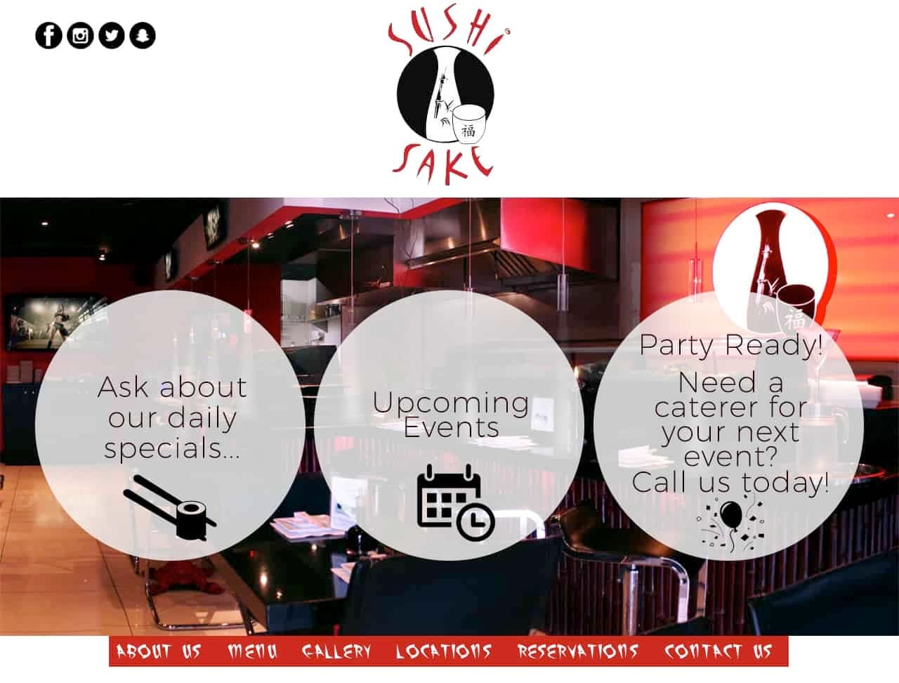
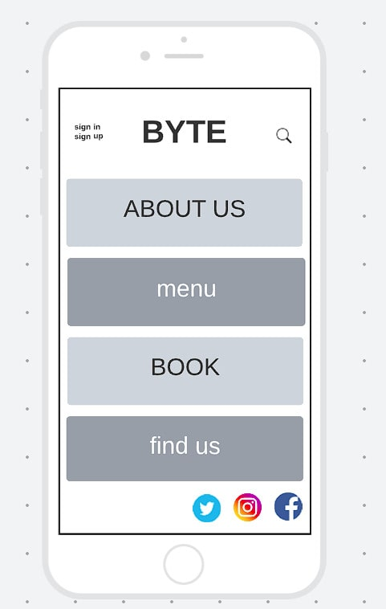

Project set-up

    cmnd:  django-admin startproject 'project name' .

    Adding app for bookings
        cmnd:   python3 manage.py startapp 'app name'
        Register app name under installed_apps in settings.py

    Allauth set up
       cmnd: pip3 install allauth
        Add lines 
                    # `allauth` needs this from django
                    'django.template.context_processors.request',
        under templates in settings.py
        Add lines
                    'django.contrib.sites',

                    'allauth',
                    'allauth.account',
                    'allauth.socialaccount',
        under installed_apps in settings.py

        Create section in settings above templates
                    AUTHENTICATION_BACKENDS = [
                    # Needed to login by username in Django admin, regardless of `allauth`
                    'django.contrib.auth.backends.ModelBackend',

                    # `allauth` specific authentication methods, such as login by e-mail
                    'allauth.account.auth_backends.AuthenticationBackend',
                    ]
        Under installed apps
                    SITE_ID = 1
        In urls.py
                    from django.urls import path, include
                    from django.conf import settings

                    urlpatterns = [
                        path('accounts/', include('allauth.urls')),
                    ]
        
        allauth customisation

    To copy and paste folders and files from allauth site-packages first determine python version installed using cmnd: python --version In this case python3 3.8
    Create a folder, templates, and subfolder, allauth, from the project level directory
    Then run cmnd: 
    cp -r ../.pip-modules/lib/python3.8/site-packages/allauth/templates/* ./templates/allauth/

    Delete openid and tests folders, as unneeded for this project, deleting will revert use to site_packages templates for same.

UX/UI

Example sites for restaurant home pages

Wireframes for project mock-up

Logic

Booking logic Flowchart

Plans for Models

Testing and Errors

    1
    Issue: Changes made to allauth html files take no effect on rendered pages in development server
    Resolve: Included the following lines in project settings:
        "TEMPLATES_DIR = os.path.join(BASE_DIR, 'templates')"
        "TEMPLATES = [
            {
                'BACKEND': 'django.template.backends.django.DjangoTemplates',
                'DIRS': [TEMPLATES_DIR],
                ..."

    2
    Issue: Can't render home view. Attempting to run dev server from terminal results in: AttributeError: module 'home.views' has no attribute 'index'
    Resolve: Apps were not registered in project settings. Additional changes to settings made, including targeting media and static. Homepage functional.

    3.
    Issue: Bookings toggle the table model boolean of availability to a constant false. However, we only want this toggled for the time and day of a booking.
    Resolve: Create a new model to better handle identifying available times.

    4.
    Issue: Form only accepts party sizes that match the table size. We want a party of three to be assigned to a table of 4, but a party of 2 assigned to a table of 2 before a 4.
    Resolve: View now searches for tables with availability that have an occupancy greater or equal to the party size, and searches for the smallest possible table first.

    env.py content

    import os

os.environ.setdefault("SECRET_KEY", "Oisin")
os.environ.setdefault("DEBUG", "True")
os.environ.setdefault("IP", "0.0.0.0.")
os.environ.setdefault("PORT", "8000")
os.environ.setdefault("DEVELOPMENT", "True")
os.environ.setdefault("DB_URL", "sqlite3:///byte")
os.environ.setdefault("ALLOWED_HOSTS", "localhost")
